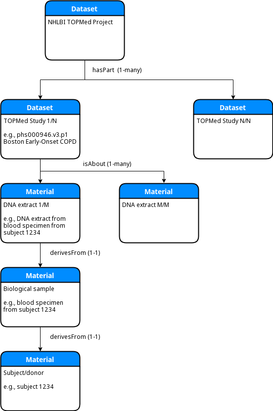

# KC7 Crosscut Metadata Model 

The aim of the crosscut metadata model is to provide a uniform encoding of metadata obtained 
from the following DCPPC data sources:

* AGR - [Alliance of Genome Resources](https://www.alliancegenome.org/)
* GTEx - [Genotype-Tissue Expression project](https://www.gtexportal.org/home/)
* TOPMed - [Trans-Omics for Precision Medicine](https://www.nhlbi.nih.gov/science/trans-omics-precision-medicine-topmed-program)


## Metadata Model versus Instance

The metadata _model_ specifies _how_ the various metadata will be transformed into a uniform representation,
whereas the metadata model _instance_ is the transformed representation itself. The metadata model is based
on a JSON-LD encoding of [DATS](https://www.nature.com/articles/sdata201759), the DatA Tag Suite data model 
developed through the Big Data To Knowledge (BD2K) initiative to support dataset discoverability. See below 
for a description of how each of the 3 main datasets' metadata are encoded in DATS.

## SPARQL Queries

One of the quickest ways to gain familiarity with the metadata model and the current instance is to examine
and run the example SPARQL queries. To do this, first read and follow the instructions in the next section,
entitled "Downloading the Public Crosscut Metadata Model Instance". Then retrieve and run the scripts in 
the following directory as directed in the README.md therein:

https://github.com/dcppc/crosscut-metadata/tree/master/sparql

## Downloading the Public Crosscut Metadata Model Instance

The crosscut metadata model instance, which is essentially a small set of JSON-LD files, is distributed 
as a [BDBag](http://bd2k.ini.usc.edu/tools/bdbag/). BDBags for all current releases can be found in the 
[releases/](https://github.com/dcppc/crosscut-metadata/tree/master/releases)
subdirectory. Each BDBag is a gzipped tar file that can be retrieved, extracted and uncompressed with 
standard Unix or Mac OS command line utilities. On a Mac, for example, the latest (as of this writing) 
v0.4 release can be retrieved and uncompressed with the following commands:

```
$ curl -s -O 'https://raw.githubusercontent.com/dcppc/crosscut-metadata/master/releases/KC7-crosscut-metadata-v0.4.tgz'
$ tar xzvf KC7-crosscut-metadata-v0.4.tgz 
x KC7-crosscut-metadata-v0.4/
x KC7-crosscut-metadata-v0.4/tagmanifest-md5.txt
x KC7-crosscut-metadata-v0.4/bagit.txt
x KC7-crosscut-metadata-v0.4/bag-info.txt
x KC7-crosscut-metadata-v0.4/tagmanifest-sha256.txt
x KC7-crosscut-metadata-v0.4/manifest-md5.txt
x KC7-crosscut-metadata-v0.4/data/
x KC7-crosscut-metadata-v0.4/data/datasets/
x KC7-crosscut-metadata-v0.4/data/datasets/TOPMed_phs000951_phs000946_phs001024_wgs_public.jsonld
x KC7-crosscut-metadata-v0.4/data/datasets/GTEx_v7_rnaseq_20_SAMPLES_public.jsonld
x KC7-crosscut-metadata-v0.4/data/datasets/GTEx_v7_dbGaP_public.jsonld
x KC7-crosscut-metadata-v0.4/data/datasets/GTEx_v7_rnaseq_public.jsonld
x KC7-crosscut-metadata-v0.4/data/docs/
x KC7-crosscut-metadata-v0.4/data/docs/RELEASE_NOTES
x KC7-crosscut-metadata-v0.4/data/docs/ChangeLog
x KC7-crosscut-metadata-v0.4/manifest-sha256.txt
```

After uncompressing the DATS JSON-LD files can be found in `KC7-crosscut-metadata-v0.4/data/datasets`:

```
$ ls -al KC7-crosscut-metadata-v0.4/data/datasets/
total 309128
drwxr-xr-x  6 jcrabtree  staff        192 Aug 23 17:53 .
drwxr-xr-x  4 jcrabtree  staff        128 Aug 23 17:53 ..
-rw-r--r--  1 jcrabtree  staff     913969 Aug 23 17:53 GTEx_v7_dbGaP_public.jsonld
-rw-r--r--  1 jcrabtree  staff     308617 Aug 23 17:53 GTEx_v7_rnaseq_20_SAMPLES_public.jsonld
-rw-r--r--  1 jcrabtree  staff  155599140 Aug 23 17:53 GTEx_v7_rnaseq_public.jsonld
-rw-r--r--  1 jcrabtree  staff    1440574 Aug 23 17:53 TOPMed_phs000951_phs000946_phs001024_wgs_public.jsonld
```

Note that if the `bdbag` utility is run to extract the BDBag after unpacking it then the `data` portion 
of the above path will not be present.


## Building the Public Crosscut Metadata Model Instance

The script to build the public crosscut metadata model instance is called `make-crosscut-instance-bdbag.sh`
and can be found in the top level of this repository:

https://github.com/dcppc/crosscut-metadata/blob/master/make-crosscut-instance-bdbag.sh

The script contains the commands to perform the DATS metadata conversion for each of the currently supported
data (sub)sets, but as the comments in the file indicate, the metadata flat files for each of the data
sources must first be downloaded to the current directory:

### AGR/MGI

The current v0.4 release does not include any DATS JSON encoding for AGR. The v0.3 and earlier releases 
contained a prototype AGR encoding that consisted of the C57/BL6 mouse reference genome, annotation, and 
predicted orthologs.

### GTEx

For GTEx the following two files are needed from https://www.gtexportal.org/home/datasets:

```
GTEx_v7_Annotations_SubjectPhenotypesDS.txt
GTEx_v7_Annotations_SampleAttributesDS.txt
```

In addition the public dbGaP variable summaries and data dictionaries should be downloaded
from the following URL into a local directory named `phs000424.v7.p2`:

```
ftp://ftp.ncbi.nlm.nih.gov/dbgap/studies/phs000424/phs000424.v7.p2/pheno_variable_summaries/
```

### TOPMed

For the example TOPMed studies (phs001024, phs000951, and phs000179) the public TOPMed dbGaP
variable summaries and data dictionaries should be downloaded from the following URLs into
local directories named `phs001024.v3.p1`, `phs000951.v2.p2`, and `phs000179.v5.p2`, 
respectively:

```
ftp://ftp.ncbi.nlm.nih.gov/dbgap/studies/phs001024/phs001024.v3.p1/pheno_variable_summaries/
ftp://ftp.ncbi.nlm.nih.gov/dbgap/studies/phs000951/phs000951.v2.p2/pheno_variable_summaries/
ftp://ftp.ncbi.nlm.nih.gov/dbgap/studies/phs000179/phs000179.v5.p2/pheno_variable_summaries/
```

### Other Prerequisites

In order to run the part of the script that creates the BDBag, the `bdbag` command-line utility
must be installed like so:

```
pip install bdbag
```


## Building the Access-Restricted Crosscut Metadata Model Instance

The script mentioned above, `make-crosscut-instance-bdbag.sh`, also contains example commands 
(which are commented out by default) showing how to generate DATS JSON for the access-restricted 
metadata available from dbGaP for the GTEx and TOPMed studies. Download the access-restricted 
dbGaP files to a local directory with the appropriate access controls, and then tell the 
conversion script where to find the public and access-restricted metadata files, as in the
following command:

```
./bin/topmed_to_dats.py --dbgap_accession_list='phs001024.v3.p1,phs000951.v2.p2,phs000179.v5.p2' \
  --dbgap_public_xml_path=./dbgap-data \
  --dbgap_protected_metadata_path=./restricted-access-dbgap-data \
  --output_file=$EXTERNAL_ID/datasets/TOPMed_phs000951_phs000946_phs001024_wgs_RESTRICTED.jsonld
```

## DATS-JSON validation

The DATS JSON-LD files have all been validated against the latest (as of this writing) version of 
DATS from

https://github.com/datatagsuite

using the validator in

https://github.com/datatagsuite/dats-tools. 

This repository contains an extension of DATS that is specific to this project and the crosscut 
metadata model instance JSON-LD files will NOT necessarily validate against the current DATS release 
found at https://github.com/biocaddie/WG3-MetadataSpecifications. Any changes to the DATS JSON files
should be checked against the validator before creating a new release of the metadata model instance.

## Model Description

This section describes how the GTEx and TOPMed datasets are currently encoded in DATS and discusses 
some of the tradeoffs and shortcomings of the encoding. The encoding is by no means set in stone 
and the process of refining and improving it is still ongoing. Concomitant adjustments are also 
being made to the DATS model in some cases to facilitate the encoding of some aspects of the metadata.
In this release (v0.4) the AGR encoding is being developed and reworked to handle the 
recently-approved KC7 use cases and a new DATS JSON instance for AGR is scheduled to be released
on or before the following release/milestone:

https://github.com/dcppc/crosscut-metadata/issues/32

### GTEx/TOPMed encoding

At the top level of both the GTEx and TOPMed encoding is a DATS `Dataset` that represents the project
(GTEx) or program (TOPMed) as a whole. This top level `Dataset` is linked by the `hasPart` property
to an array of DATS `Datasets`, each of which represents a specific study (in the general sense, since
`Study` is a DATS entity in its own right.) For TOPMed each of the 2nd-level `Dataset` entities 
corresponds to a dbGaP study, meaning either a TOPMed study or a parent study. In the dbGaP encoding
there is likewise a 2nd level `Dataset` that represents the corresponding dbGap study. However, 
there is also a distinct 2nd level `Dataset` that represents the RNA-Seq data that is publicly available 
from the GTEx Portal at https://gtexportal.org/home/. Below these 2nd level `Datasets` that represent
a combination of study and data type (e.g., WGS, RNA-Seq) are 3rd level `Datasets` that represent
the individual data files/products produced in the study. Below the GTEx RNA-Seq study, for example,
the DATS `hasPart` property links to an array of DATS `Dataset`s, each of which represents one of the 
public RNA-Seq data files available from https://www.gtexportal.org/home/datasets These sub-`Dataset`s 
make use of the KC2-provided DataCite GUIDs as their JSON-LD ids. For example, note the `doi.org` URI 
in the JSON snippet below:

```
      "@type": "Dataset",
      "@context": "https://w3id.org/dats/context/sdo/dataset_context.jsonld",
      "@id": "https://doi.org/10.25491/zzv1-xb48",
      "identifier": {
        "@type": "Identifier",
        "@id": "",
        "identifier": "GTEx_Analysis_2016-01-15_v7_RNA-SEQ_GTEx_Analysis_2016-01-15_v7_RNASeQCv1.1.8_gene_reads.gct.gz"
      },
```

Each of the second level DATS `Dataset` objects is in turn linked to an array of DATS `Material` objects
by the `isAbout` property. Each of those `Materials` represents an RNA extract used in the RNA-Seq protocol
or, in the case of WGS sequence data, a DNA extract used in WGS sequencing.
In DATS a `Material` may be linked to one or more additional `Material` objects via the `derivesFrom` 
property. In the GTEx and TOPMed encoding each RNA (or DNA) extract `Material` is linked first (via 
`derivesFrom`) to a `Material` that represents a biological sample from a particular body site. That 
biological sample `Material` is further linked (also via `derivesFrom`) to a `Material` that represents 
the individual human donor/subject, as shown in the following ER diagram:


In the public version of the GTEx DATS RNA-Seq encoding all of the human subjects, samples, and RNA 
extracts are represented, but some of the phenotype and/or sample data may be limited. For example, 
instead of specifying each subject's exact age, only an "Age range" (e.g,. "60-69") is provided.

In all of the dbGaP-based public DATS JSON encodings (both for GTEx and TOPMed) the entities that
represent human subjects, samples, and RNA/DNA extracts are dummy entities produced by picking the
most commonly-occurring values from the dbGaP variable summary reports.

The following simplified ER diagram illustrates the overall structure, using the TOPMed encoding as an example:



