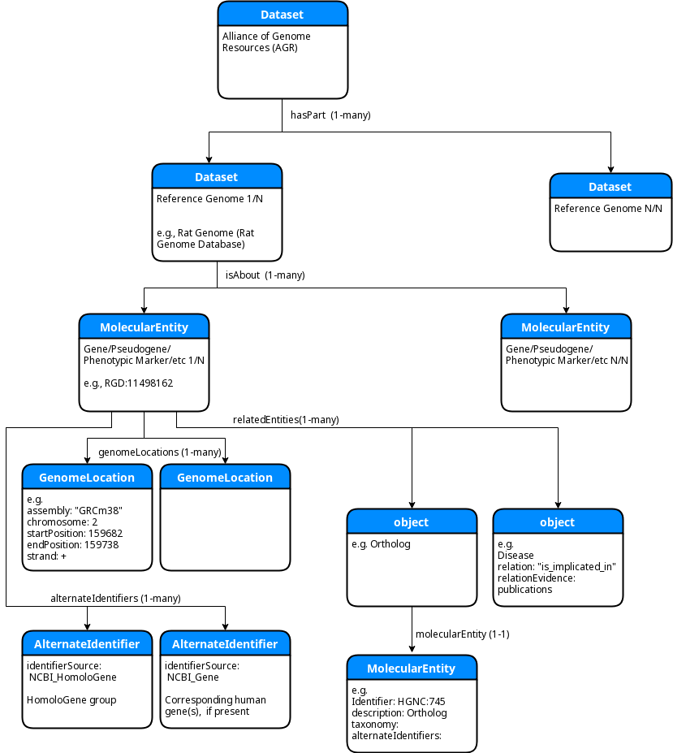
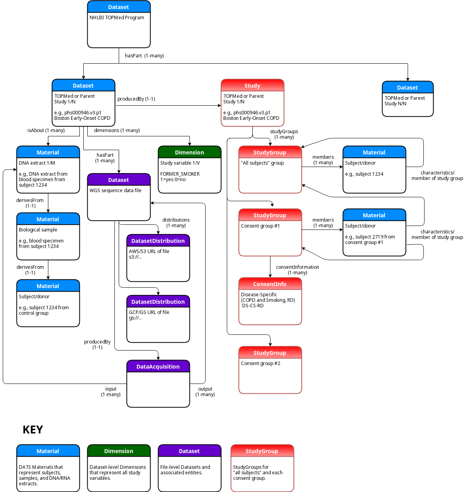
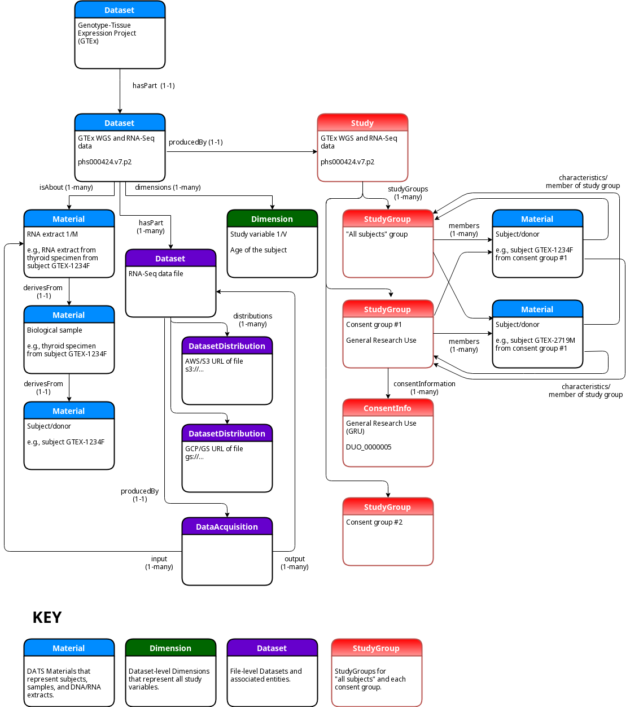

# KC7 Crosscut Metadata Model 

The aim of the crosscut metadata model is to provide a uniform encoding of metadata obtained 
from the following DCPPC data sources:

* AGR - [Alliance of Genome Resources](https://www.alliancegenome.org/)
* GTEx - [Genotype-Tissue Expression project](https://www.gtexportal.org/home/)
* TOPMed - [Trans-Omics for Precision Medicine](https://www.nhlbi.nih.gov/science/trans-omics-precision-medicine-topmed-program)


## Metadata Model versus Instance

The metadata _model_ specifies _how_ the various metadata will be transformed into a uniform representation,
whereas the metadata model _instance_ is the transformed representation itself. The metadata model is based
on a JSON-LD encoding of [DATS](https://www.nature.com/articles/sdata201759), the DatA Tag Suite data model 
developed through the Big Data To Knowledge (BD2K) initiative to support dataset discoverability. Several 
extensions to DATS, along with schema.org and OBO Foundry-based JSON-LD context files, have been developed 
to support the crosscut metadata model. These extensions and context files can be found in the DATS GitHub
repository at https://github.com/datatagsuite. For more information on how the 3 main datasets' metadata 
are encoded in DATS, see the relevant sections below.

## SPARQL Queries

For those familiar with RDF and SPARQL, one of the quickest ways to gain familiarity with the metadata model 
and the current instance is to examine and run the example SPARQL queries. To do this, first read and follow 
the instructions in the next section, entitled "Downloading the Public Crosscut Metadata Model Instance". 
Then retrieve and run the scripts in the following directory, as directed in the README.md therein:

https://github.com/dcppc/crosscut-metadata/tree/master/sparql/v0.6

## Downloading the Public Crosscut Metadata Model Instance

The crosscut metadata model instance, which is essentially a small set of JSON-LD files, is distributed 
as a [BDBag](http://bd2k.ini.usc.edu/tools/bdbag/). BDBags for all current public releases can be found 
in the [releases/](https://github.com/dcppc/crosscut-metadata/tree/master/releases)
subdirectory. Each BDBag is a gzipped tar file that can be retrieved, extracted and uncompressed with 
standard Unix or Mac OS command line utilities. On a Mac, for example, the latest (as of this writing) 
v0.6 release can be retrieved and uncompressed with the following commands:

```
$ curl -s -O 'https://raw.githubusercontent.com/dcppc/crosscut-metadata/master/releases/KC7-crosscut-metadata-v0.6.tgz'
$ tar xzvf KC7-crosscut-metadata-v0.6.tgz 
x KC7-crosscut-metadata-v0.6/
x KC7-crosscut-metadata-v0.6/tagmanifest-md5.txt
x KC7-crosscut-metadata-v0.6/bagit.txt
x KC7-crosscut-metadata-v0.6/bag-info.txt
x KC7-crosscut-metadata-v0.6/tagmanifest-sha256.txt
x KC7-crosscut-metadata-v0.6/manifest-md5.txt
x KC7-crosscut-metadata-v0.6/data/
x KC7-crosscut-metadata-v0.6/data/datasets/
x KC7-crosscut-metadata-v0.6/data/datasets/TOPMed_phs000951_phs000946_phs001024_wgs_public.jsonld
x KC7-crosscut-metadata-v0.6/data/datasets/GTEx_v7_public.jsonld
x KC7-crosscut-metadata-v0.6/data/datasets/AGR_MGI_RGD.jsonld
x KC7-crosscut-metadata-v0.6/data/docs/
x KC7-crosscut-metadata-v0.6/data/docs/RELEASE_NOTES
x KC7-crosscut-metadata-v0.6/data/docs/ChangeLog
x KC7-crosscut-metadata-v0.6/manifest-sha256.txt
```

After uncompressing the DATS JSON-LD files can be found in `KC7-crosscut-metadata-v0.6/data/datasets`:

```
$ ls -al KC7-crosscut-metadata-v0.6/data/datasets/
total 1457784
drwxr-xr-x  5 jcrabtree  staff        160 Sep 14 19:47 .
drwxr-xr-x  4 jcrabtree  staff        128 Sep 14 19:56 ..
-rw-r--r--  1 jcrabtree  staff  421546018 Sep 14 19:47 AGR_MGI_RGD.jsonld
-rw-r--r--  1 jcrabtree  staff  323335853 Sep 14 19:47 GTEx_v7_public.jsonld
-rw-r--r--  1 jcrabtree  staff    1497331 Sep 14 19:47 TOPMed_phs000951_phs000946_phs001024_wgs_public.jsonld
```

Note that if the `bdbag` utility is run to extract the BDBag after unpacking it then the `data` portion 
of the above path will not be present.

## Building the Public Crosscut Metadata Model Instance

The script to build the public crosscut metadata model instance is called `make-crosscut-instance-bdbag.sh`
and can be found in the top level of this repository:

https://github.com/dcppc/crosscut-metadata/blob/master/make-crosscut-instance-bdbag.sh

The script contains the commands to perform the DATS metadata conversion for each of the currently supported
data (sub)sets, but as the comments in the file indicate, the metadata flat files for each of the data
sources must first be downloaded to the current directory:


### AGR / Alliance of Genome Resources

For AGR the following resources are needed to generate the current instance, which includes reference
annotation for  mouse and rat:

AGR filtered ortholog .tsv file:
*  alliance-orthology-july-19-2018-stable-1.6.0-v4.tsv

AGR Basic Gene Information (BGI), GFF3, and disease_json files:
* MGI_1.0.4_BGI.json
* MGI_1.0.4_disease.json
* MGI_1.0.4_GFF.gff
* RGD_1.0.4_BGI.json
* RGD_1.0.4_disease.json
* RGD_1.0.4_GFF.gff


### GTEx

For GTEx the following two files are needed from https://www.gtexportal.org/home/datasets:

```
GTEx_v7_Annotations_SubjectPhenotypesDS.txt
GTEx_v7_Annotations_SampleAttributesDS.txt
```

In addition the public dbGaP variable summaries and data dictionaries should be downloaded
from the following URL into a local directory named `phs000424.v7.p2`:

```
ftp://ftp.ncbi.nlm.nih.gov/dbgap/studies/phs000424/phs000424.v7.p2/pheno_variable_summaries/
```

Finally, the manifest and id dump files from the DCPPC data-stewards GitHub repository are
required:

```
git clone https://github.com/dcppc/data-stewards.git
```

### TOPMed

For the example TOPMed studies (phs001024, phs000951, and phs000179) the public TOPMed dbGaP
variable summaries and data dictionaries should be downloaded from the following URLs into
local directories named `phs001024.v3.p1`, `phs000951.v2.p2`, and `phs000179.v5.p2`, 
respectively:

```
ftp://ftp.ncbi.nlm.nih.gov/dbgap/studies/phs001024/phs001024.v3.p1/pheno_variable_summaries/
ftp://ftp.ncbi.nlm.nih.gov/dbgap/studies/phs000951/phs000951.v2.p2/pheno_variable_summaries/
ftp://ftp.ncbi.nlm.nih.gov/dbgap/studies/phs000179/phs000179.v5.p2/pheno_variable_summaries/
```

### Other Prerequisites

In order to run the part of the script that creates the BDBag, the `bdbag` command-line utility
must be installed like so:

```
pip install bdbag
```

## Downloading the Controlled Access Crosscut Metadata Model Instance (DCPPC whitelisted users only)

The procedure for downloading the controlled access version of the metadata model can be found at
[/docs/controlled_access_download.md](/docs/controlled_access_download.md)

## Building the Access-Controlled Crosscut Metadata Model Instance

The script mentioned above, `make-crosscut-instance-bdbag.sh`, also contains example commands 
(which are commented out by default) showing how to generate DATS JSON for the access-controlled 
metadata available from dbGaP for the GTEx and TOPMed studies. Download the access-controlled 
dbGaP files to a local directory with the appropriate access controls, and then tell the 
conversion script where to find the public and access-controlled metadata files, as shown in
the script.

## DATS-JSON validation

Modified versions of the public DATS JSON-LD files have all been validated against the latest 
(as of this writing) version of DATS from

https://github.com/datatagsuite

using the validator in

https://github.com/datatagsuite/dats-tools. 

This repository contains an extension of DATS that is specific to this project and the crosscut 
metadata model instance JSON-LD files will NOT necessarily validate against the current DATS release 
found at https://github.com/biocaddie/WG3-MetadataSpecifications. Any changes to the DATS JSON files
are checked against the validator before creating a new release of the metadata model instance.

Validation was performed using modified versions of the JSON-LD files because the DATS validator 
does not yet support circular links or arbitrary id references in the JSON-LD files. Circular links
are removed and id references are dereferenced for validation and then added back in to create the
final released JSON-LD files. Comments in the `make-crosscut-instance-bdbag.sh` script describe 
how this is done.

## Model Description

This section describes how the three datasets are currently encoded in DATS and discusses 
some of the tradeoffs and shortcomings of the encoding. The encoding is by no means set in stone 
and the process of refining and improving it is still ongoing. Concomitant adjustments are also 
being made to the DATS model in some cases to facilitate the encoding of some aspects of the metadata.

### AGR encoding

Similar to the GTEx and TOPMed encodings, the top level of the AGR JSON-LD structure is a DATS
`Dataset` that represents all Alliance data. Below that is a set of 2nd-level `Dataset` entities,
linked by the `hasPart` property. Those 2nd-level `Datasets` correspond to the individual reference
genomes from the model organism databases that comprise the Alliance. The similarity with the
GTEx and TOPMed encodings ends at this point: below each 2nd-level `Dataset` is an array of 
`MolecularEntity` objects, linked to it by the `isAbout` property. These `MolecularEntities`
represent the genes and/or pseudogenes in each reference genome and make use of the new (as of v0.6)
DATS `GenomeLocation` schema to specify the genomic sequence location(s) associated with each.
The DATS `alternateIndentifiers` of each gene link it to the corresponding NCBI_HomoloGene group
and/or human gene(s). The `relatedEntities` property provides explicit links to orthologs (i.e., 
represented as a DATS `MolecularEntity`) as well as disease and/or phenotype relationships. 
The following ER diagram illustrates the overall structure:



### GTEx and TOPMed encodings

At the top level of both the GTEx and TOPMed encoding is a DATS `Dataset` that represents the project
(GTEx) or program (TOPMed) as a whole. This top level `Dataset` is linked by the `hasPart` property
to an array of DATS `Datasets`, each of which represents a specific study (in the general sense, since
`Study` is a DATS entity in its own right.) For both TOPMed and GTEx each of the 2nd-level `Dataset` 
entities corresponds to a dbGaP study. For GTEx there is only one such study, phs000424, but for 
TOPMed there are several, some of which are "parent" studies (i.e., they existed in dbGaP before 
becoming part of the TOPMed program) and some of which are "TOPMed" studies (i.e., the ones with 
which the TOPMed WGS data are associated.) Below these 2nd level `Datasets` that represent studies 
are 3rd level `Datasets` that represent the individual data files/products produced by the study. 
Below the GTEx dbGAP study, for example, the DATS `hasPart` property links to an array of DATS 
`Datasets`, each of which represents one of the access-controlled RNA-Seq or WGS data files.

Each of the second level DATS `Dataset` objects is in turn linked to an array of DATS `Material` objects
by the `isAbout` property. Each of those `Materials` represents an RNA extract used in the RNA-Seq
protocol or, in the case of WGS sequence data, a DNA extract used in WGS sequencing.
In DATS a `Material` may be linked to one or more additional `Material` objects via the `derivesFrom` 
property. In the GTEx and TOPMed encoding each RNA (or DNA) extract `Material` is linked first (via 
`derivesFrom`) to a `Material` that represents a biological sample from a particular body site. That 
biological sample `Material` is further linked (also via `derivesFrom`) to a `Material` that represents 
the individual human donor/subject, as shown in the following ER diagram:

In the public version of the GTEx DATS encoding all of the human subjects, samples, and RNA and DNA
extracts are represented, but some of the phenotype and/or sample data may be limited. For example, 
instead of specifying each subject's exact age, only an "Age range" (e.g,. "60-69") is provided.

In all of the dbGaP-based public TOPMed DATS JSON encoding the entities that represent human subjects, 
samples, and RNA/DNA extracts are dummy entities produced by picking the most commonly-occurring 
values from the dbGaP variable summary reports.

The following simplified ER diagram illustrates the overall structure of the TOPMed encoding:



And this (very similar) one does the same for the GTEx encoding:



