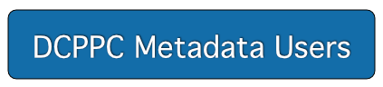
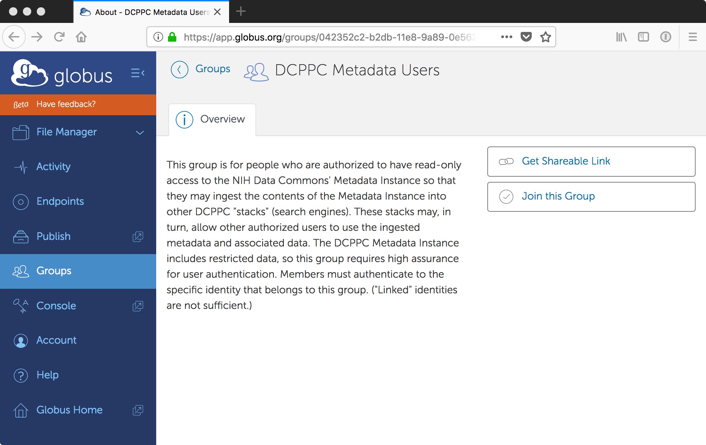
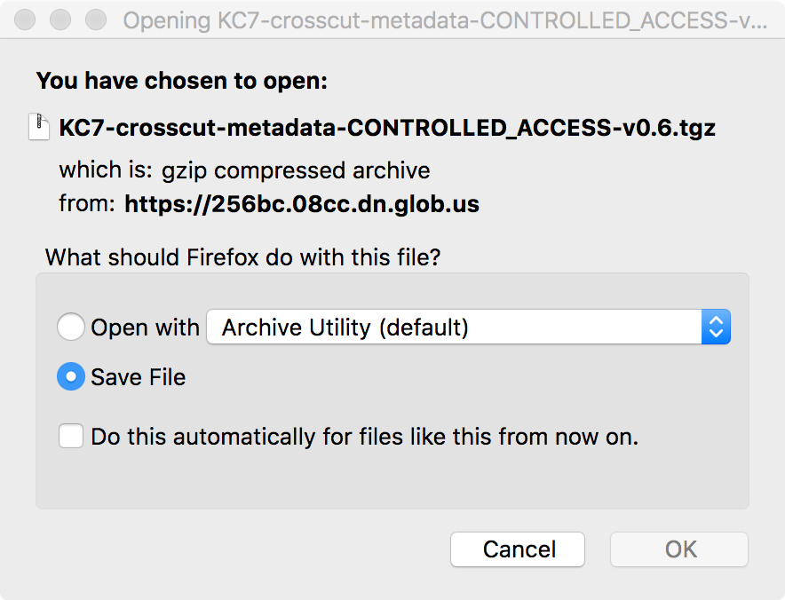

# KC7 Controlled Access Crosscut Metadata Instance

This page describes how to access the KC7 Controlled Access Crosscut Metadata Instance. This resource is specifically for operators of DCPPC Full Stacks who need to ingest the KC7 Controlled Access Crosscut Metadata Instance into their stacks. Because the Metadata Instance contains restricted data, access is limited to DCPPC members who are on the DCPPC DAR Whitelist. If you are not currently on the DAR Whitelist, use the DCPPC's [on-boarding application](https://docs.google.com/forms/d/e/1FAIpQLScg6X7Ce5PdP6EeEGWBAojt1Y6nn65FRKxvM8MqattL8ZnieQ/viewform) to request access.

The KC7 Controlled Access Crosscut Metadata Instance is stored in a secure Amazon AWS VPC. On this web page, you will find a [MINID](http://minid.bd2k.org/) (minimum viable identifier) that references the instance and includes an HTTPS (secure HTTP) link to it. The link can be used in any standard Web browser, but access to the file is secured by Team Argon's Globus service. You must authenticate to your white-listed identity to access the instance. The instance itself is a [BDBag](https://github.com/fair-research/bdbag).

## Step 1: Login to Globus and find the DCPPC Metadata Users group

Access to the KC7 Controlled Access Crosscut Metadata Instance is authorized by membership in the DCPPC Metadata Users group in Globus. You must join this group to access the metadata instance.

Click the button below to open the Globus Web app and locate the DCPPC Metadata Users group. 

> You must login to Globus using your white-listed identity, preferably one issued by your academic/research institution. Most DCPPC member institutions are available in Globus. If you are certain that yours is not, you may use ORCID if you have an ORCID ID or National Institutes of Health if you have an iTrust ID. Otherwise, please seek help (see the final section on this page) to identify an acceptable identity provider.

> If you click this button and are not asked to login, please click "Account" in the left-side panel to ensure that you're already logged in with a white-listed identity. If you aren't, logout of the Globus Web app and login with your white-listed identity. Then click the button above to return to the DCPPC Metadata Users Group page.

You will now see the DCPPC Metadata Users group page. Click "Join this Group”.

## Step 2: Submit request to join the group

Now, you must complete your request to join the group. Make certain that the identity selected in the "Select which username to join as" pulldown menu is an identity that appears on the DCPPC whitelist.

Fill in some informational fields and click "Submit Application.”

You’ll receive an email notification that your membership is pending.

## Step 3: Approval

Your application will be reviewed by a member of Team Phosphorus or Team Argon and compared with the DAR Whitelist. Assuming your application is approved, you’ll receive an email confirmation like the one below.

## Step 4: Access the KC7 Controlled Access Crosscut Metadata Instance

Now that you are a member of the DCPPC Metadata Users group, you can access the KC7 Controlled Access Crosscut Metadata Instance. *Remember that your access is specifically to ingest the metadata into your Full Stack, and is subject to the DCPPC's rules for storing and accessing restricted data.*

Here is the MINID for the metadata instance:

> [https://identifiers.globus.org/ark:/57799/b9lxYKZ1zL8H3b](https://identifiers.globus.org/ark:/57799/b9lxYKZ1zL8H3b)

When you click the link above it will take you to a "landing page" for the metadata instance.

The link in the "location" field provides access to the metadata instance. Click this link and you will be required to authenticate with Globus. (Globus requires separate authentication for each application when dealing with restricted data. Downloading data is a separate application.)

Be sure to use your whitelisted identity when authenticating. When you successfully authenticate, your Web browser will download the file containing the KC7 Controlled Access Crosscut Metadata Instance. *Take care where you store the file: this is restricted data!*

You now have the KC7 Controlled Access Crosscut Metadata Instance on your local system and can ingest the file into your Full Stack. When your data ingestion is complete, be sure to delete the downloaded file.

## Get help

If you encounter any issues when accessing the KC7 Controlled Access Crosscut Metadata Instance, you may contact the KC7 group on the DCPPC `#kc7-search` Slack channel. Or, you may file an issue in the [dcppc/crosscut-metadata](https://github.com/dcppc/crosscut-metadata/issues) project in GitHub.
